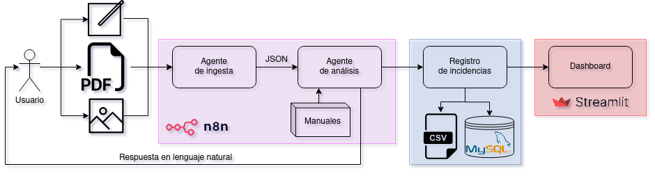
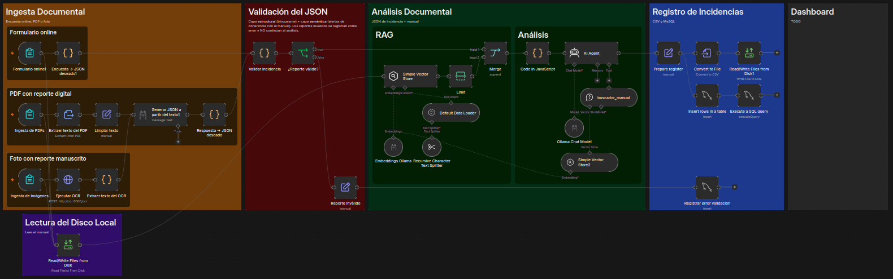
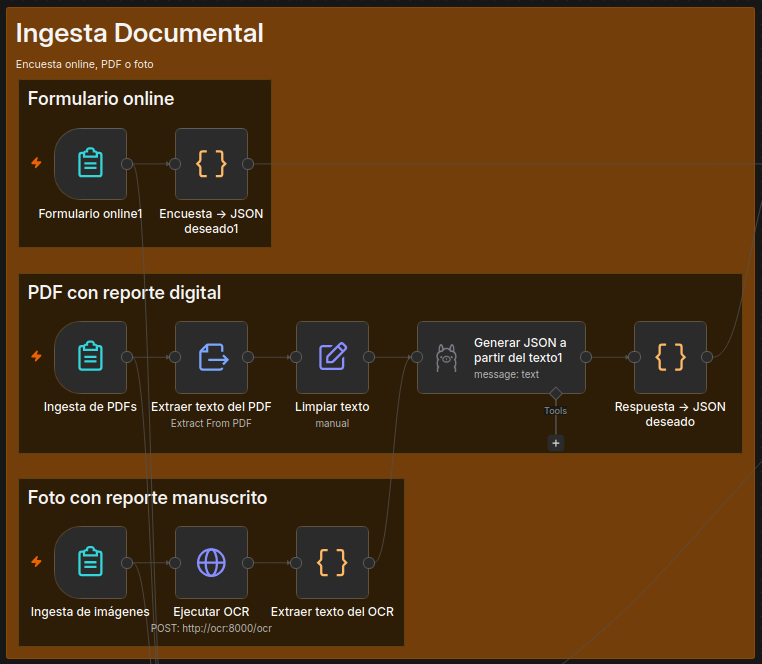
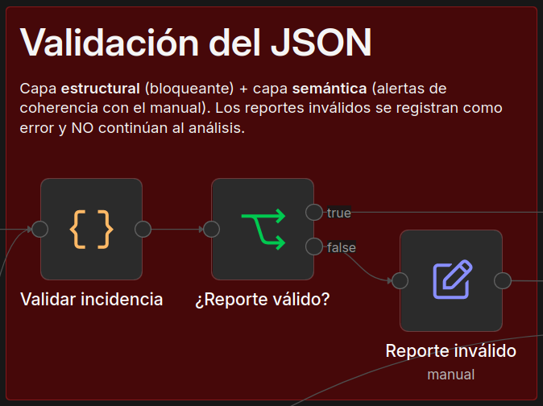
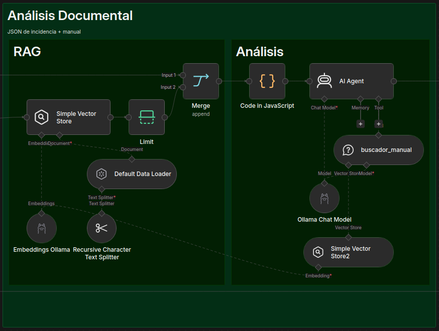
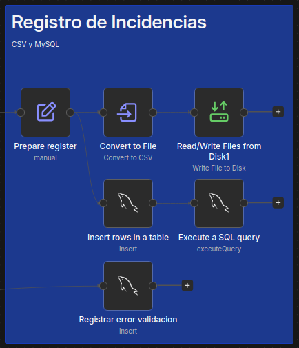
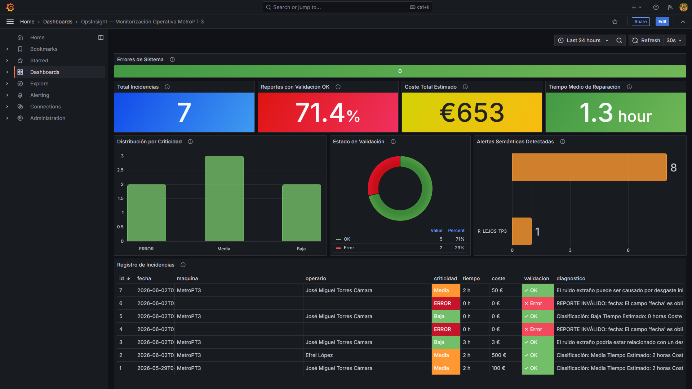

# Trabajo de Final de Máster (TFM)
Este repositorio continene información, datos y documentos desarrollados para mi TFM del máster en Big Data y Visual Analytics de la UNIR. Los archivos se estructuran de la siguiente forma:
- [`datos/`](datos/): Carpeta con los **datos** utilizados para desarrollar y testear la solución. Algunos de los archivos clave son:
  - [`plantilla_reporte_incidencia.odt`](datos/plantilla_reporte_incidencia.odt): Plantilla que los usuarios podrían utilizar para reportar incidencias. Puede rellenarse virtualmente y generar un PDF a partir de ella o imprimirse para rellenarse a mano y darle al sistema una foto del formulario rellenado a mano.
  - [`ejemplo_incidencia.json`](datos/ejemplo_incidencia.json): Ejemplo de JSON que deberá generar el agente de ingesta y que debe recibir el agente de análisis documental.
  - [`ejemplo_incidencia.pdf`](datos/ejemplo_incidencia.pdf): Ejemplo de un reporte de incidencia digital en PDF que podría recibir el agente de ingesta.
  - [`ejemplos_imagenes/`](datos/ejemplos_imagenes/): Ejemplos de fotografías de reportes de incidencia que podría recibir el agente de ingesta. Hay uno totalmente manuscrito, otro totalmente impreso y otro híbrido (enunciados impresos y datos rellenados a mano).
  - [`manual_MetroPT3.md`](datos/manual_MetroPT3.md): Manual en MarkDown de una supuesta máquina MetroPT3. Se basa en los datos del [dataset MetroPT3](https://archive.ics.uci.edu/dataset/791/metropt+3+dataset), que contiene datos reales de la Unidad de Producción de Aire (APU) de un metro.
  - [`historico_incidencias.csv`](datos/historico_incidencias.csv): CSV con un ejemplo de un registro histórico de incidencias reportadas. Replica el contenido que tendría la base de datos relacional MySQL.
- [`doc/`](doc/): Carpeta con **documentación** detallada sobre:
  - [`propuesta.md`](doc/propuesta.md): La **propuesta de TFM escogida**, incluyendo sus objetivos, metodología y entregables.
  - [`entregas.md`](doc/entregas.md): El **contenido** esperado en cada una **de las entregas intermedias** a realizar.
  - [`desarrollo.md`](doc/desarrollo.md): Detalles técnicos sobre el desarrollo del trabajo.
- [`OpsInsight.json`](OpsInsight.json): *Workflow* de n8n que automatiza la solución completa (ingesta, validación, análisis y registro de incidencias).
- [`src/validacion/`](src/validacion/): Módulo de **validación estructural y semántica** del JSON de incidencia. Incluye lógica pura testeable (`validador.js`), 19 tests con `node:test`, y el snippet autogenerado para el nodo Code de n8n. Ver [`doc/validacion.md`](doc/validacion.md).
- [`db/schema.sql`](db/schema.sql): Schema SQL de la tabla `registro_incidencias` con las columnas de validación (`validacion_ok`, `alertas_validacion`).
- [`grafana/`](grafana/): Dashboard de **monitorización operativa** auto-provisionado en Grafana. Incluye KPIs (total incidencias, tasa validación, coste, MTTR), distribución de criticidad, alertas semánticas y registro completo. Accesible en [localhost:3000](http://localhost:3000) (admin/admin).

El trabajo consiste en un sistema que ayude a los operarios de una planta industrial a reaccionar ante incidencias con máquinas complejas. Además, este sistema, registra dichas incidencias y facilita su inspeción y análisis a través de un *dashboard*.


---

## Arquitectura 
La arquitectura se basa en un **agente IA que ingiera reportes** de incidencias en forma de encuestas, PDFs o imágenes y **genere JSONs** con la información clave, que luego se le pasan a **otro** agente que **consulta los manuales para proponer una acción** al operario. Las incidencias se **registran en un CSV y en una base de datos** relacional SQL. En base a esta, se ofrece un ***dashboard*** con el **registro** de incidencias así como varios **KPIs y gráficas** y facilitan su análisis. Esto se representa en el siguiente esquema:

<p align="center">
  
</p>

Todo esto se implementa en un ***workflow* n8n** que, a alto nivel, utiliza los siguientes componentes:

<p align="center">
  
</p>

Las zonas del *workflow* y sus vistas detalladas:

| Zona                                          | Imagen                                   |
| :-------------------------------------------- | :--------------------------------------: |
| Ingesta Documental (formulario, PDF u OCR)    |        |
| Validación del JSON (estructural + semántica) |  |
| Análisis Documental (RAG + AI Agent)          |      |
| Registro de Incidencias (MySQL + CSV)         |      |

El dashboard de monitorización en Grafana (`localhost:3000`):

<p align="center">
  
</p>


---

## Guía de Instalación y Uso
### Prerrequisitos
Como **prerrequisitos**, se asume que ya se dispone de una **instalación funcional de [Docker Desktop](https://www.docker.com/products/docker-desktop/)** así como **conocimientos básicos** de n8n y uso de Docker.


### Instalación (con Docker)
El *workflow* está automatizado con [n8n](https://n8n.io), desde donde se utilizan LLMs ejecutados en local con [Ollama](https://ollama.com/). Para utilizar este *stack*, se utilizan **contenedores [Docker](https://www.docker.com/)**. Gran parte de la instalación está automatizada el archivo [`docker-compose.yaml`](docker-compose.yaml), que realiza lo siguiente:
- Crea un **contenedor `ollama`** que abrirá un **servicio** en [ollama:11434](http://ollama:11434). Este se basa en la **imagen** [ollama/ollama](https://hub.docker.com/r/ollama/ollama). También se crea un **volumen de datos** persistente llamado `ollama` que se aloja en `/root/.ollama`.
- Crea un **contenedor `ocr`** con una API que espera peticiones HTTP POST en [ocr:8001/ocr](http://ocr:8001/ocr) que contengan una imagen binaria en su cuerpo. La API hará OCR con el algoritmo configurado y responderá con el algoritmo utilizado y el texto extraído.
- Crea un **contenedor `n8n`**, con **servicio** en [localhost:5678](http://localhost:5678), basado en la **imagen** [n8nio/n8n](https://hub.docker.com/r/n8nio/n8n) y que usa el **volumen** `n8n_data` (alojado en `/home/node/.n8n`). También se configuran varias **variables de entorno**, incluyendo el uso de la zona horaria `Europe/Madrid`. Finalmente, se le declara como **dependiente** del contenedor `ollama` para que puedan comunicarse.
- Crea un **contenedor `db`** (MySQL 8.0) con **servicio** en el puerto 3306, base de datos `opsinsight_db`, usuario `admin` / contraseña `1234`. El schema de la tabla principal está en [`db/schema.sql`](db/schema.sql).
- Crea un **contenedor `grafana`** (Grafana 11.4) con **servicio** en [localhost:3000](http://localhost:3000). El datasource MySQL y el dashboard se provisionan automáticamente al arrancar (credenciales: `admin/admin`).

Para **configurar el algoritmo de OCR**, modifica el `build` de la sección `ocr` del [`docker-compose.yaml`](docker-compose.yaml) para elegir uno de los algoritmos disponibles en [`ocr/`](ocr) (`tesseract` es más rápido pero funciona peor, especialmente para manuscritos, mientras que `paddle` es más pesado pero rinde mejor). Esto le dice a *Docker Compose* qué `Dockerfile` y `app.py` utilizar.

Para **crear estos contenedores** y ejecutarlos, debes utilizar `docker compose up -d` (`-d` es para que los contenedores se ejecuten en segundo plano). Una vez creados, podrás detenerlos y volverlos a lanzar con `docker stop [contenedor]` y `docker start [contenedor]`.

Una vez creados, es necesario **descargar el LLM** a utilizar. Por defecto, el *workflow* utiliza QWen2.5:3b y nomic-embed-text, que se descargan ejecutando `docker exec -it ollama ollama pull qwen2.5:3b` y `docker exec -it ollama ollama pull nomic-embed-text:latest`, respectivamente. Puedes ver la lista de modelos instalados en el contenedor `ollama` ejecutando `docker exec -it ollama ollama list`.

Por motivos de seguridad, n8n no exporta las credenciales de conexión al exportar el *workflow* en JSON, por lo que es necesario **configurar manualmente la credencial** del nodo de **MySQL** `Insert rows in a table` con los siguientes parámetros:
- **Host**: `mysql_db` *(Nombre del servicio del contenedor Docker, NO localhost)*
- **Database**: `opsinsight_db`
- **User**: `admin`
- **Password**: `1234`
- **Port**: `3306`

### Crear la tabla en MySQL
El *schema* de la tabla `registro_incidencias` —incluyendo las columnas de validación `validacion_ok` y `alertas_validacion`— está en [`db/schema.sql`](db/schema.sql). Para crearla, cárgalo en el contenedor:

```bash
docker exec -i mysql_db mysql -uadmin -p1234 opsinsight_db < db/schema.sql
```

### Cómo utilizarlo
Tal y como se ha mencionado, `n8n` se levanta en [localhost:5678](http://localhost:5678), por lo que para utilizar el sistema, basta con:
1. Acceder a n8n abriendo [localhost:5678](http://localhost:5678) desde un navegador.
2. Crear un nuevo *workflow* e importar [`OpsInsight.json`](OpsInsight.json).
3. Configurar la credencial de **Ollama** (`ollamaApi`, Base URL `http://ollama:11434`); la de **MySQL** se detalla en el punto anterior. Asegúrate también de enlazar el *workflow* de manejo de errores [`src/OpsInsight_ErrorHandler.json`](src/OpsInsight_ErrorHandler.json) en *Settings → Error Workflow*.
4. Lanzar el proceso con cualquiera de los *triggers* del bloque *Ingesta Documental* (encuesta, PDF o imagen).

---

## *Troubleshooting*
### Docker
**IMPORTANTE**: Asegúrate de estar utilizando el comando `docker compose` (con espacio) y NO la versión desfasada `docker-compose` (con guión).

Si algún contenedor da problemas, puedes **consultar los logs** con `docker compose logs -f [nombre_contenedor]`.

Si en algún momento algo falla, prueba a **reiniciar todos los contenedores** para volver a cargar el código Python con `volumes`. Para ello, ejecuta:

```bash
docker compose restart
docker restart [nombre_contenedor]  # n8n, ocr, ollama, etc.
```

Si sigue sin funcionar, puedes **volver a crear los contenedores** sin recompilar las imágenes (para ahorrar tiempo), esto volverá a inyectar las **variables de entorno**. Se hace con:

```bash
docker compose down
docker compose up -d --force-recreate
```

Como último recurso, puedes **reconstruir/recompilar las imágenes sin utilizar cache**. Esto permite considerar cambios en `Dockerfile`, `requierements.txt`, paquetes del sistema, variables de `build`, etc. Ejecuta:

```bash
docker compose down
docker compose build --no-cache
docker compose up -d
```

### MySQL
Para **verificar que la base de datos funciona bien**, tras lanzar el contenedor, puedes entrar en él y verificar la existencia de las BBDD usadas desde n8n ejecutando lo siguiente:

```bash
docker exec -it mysql_db bash       # Entrar al contenedor "mysql_db"
mysql --user=admin --password=1234  # Conectarte a MySQL
```

```JavaScript
SHOW DATABASES;     // Ver la lista de BBDD ("opsinsight_db" debe aparecer)
USE opsinsight_db;  // Indicar que se quiere usar la BBDD "opsinsight_db"
SHOW TABLES;        // Mostrar las tablas existentes ("registro_incidencias" debe aparecer)
```

Si n8n da errores diciendo que **falta algún campo**, puede ser porque creaste la tabla `registro_incidencias` con un esquema desfasado y [`schema.sql`](db/schema.sql), al utilizar `CREATE TABLE IF NOT EXISTS`, no la sobreescribe. Para resolverlo, **elimina la tabla vieja** con `DROP TABLE IF EXISTS registro_incidencias;` y vuelve a crearla con el esquema actualizado con:

```bash
docker exec -i mysql_db mysql -uadmin -p1234 opsinsight_db < db/schema.sql
```
