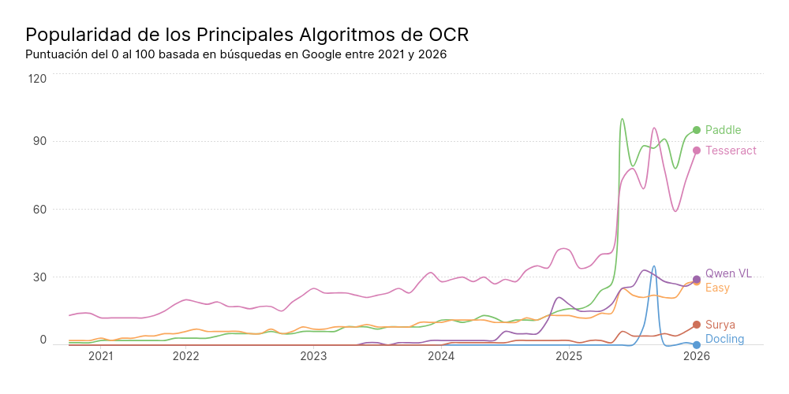

# 1. Introducción
## 1.3. Estructura del Trabajo
Tras esta **introducción** exponiendo la motivación y el planteamiento del proyecto, esta subsección se dispone a definir la estructura y el contenido de las siguientes secciones del trabajo.

La **sección 2** contiene un **estado del arte** que enumerará las fuentes investigadas y tenidas como referencia para el desarrollo del trabajo, sirviendo a su vez para definir el contexto tecnológico en el cual se desarrolla el mismo. Más en particular, se investiga el estado y uso actual de las tecnologías implicadas en el proyecto, incluyendo agentes de automatización basados en Inteligencia Artificial, algoritmos de análisis visual como Optical Character Recognition (OCR) y creación de cuadros de mando para monitorización de tareas.

La **sección 3** concretiza la definición de los **objetivos** del proyecto, tanto generales como específicos. También expone la **metodología** que se utiliza para alcanzarlos. Esto se completa con la **sección 4**, donde se detalla el marco normativo relativo a las regulaciones relevantes dado el contexto técnico del trabajo, así como los datos a utilizar y los objetivos buscados.

Las secciones siguientes son las más técnicas, ya que exponen el **desarrollo** del trabajo (**sección 5**) y el **código fuente  y** los **datos** analizados (**sección 6**).

Finalmente, se exponen las **conclusiones y** las **limitaciones** en las **secciones 7 y 8**, respectivamente.

---

# 2. Contexto y estado del arte

## Comparativa de Herramientas
**Agentes**: n8n es más potente y flexible que ActivePieces, pero este último es más sencillo de utilizar, ya que está enfocado a perfiles menos técnicos. Dada la experiencia de los integrantes del equipo, se escoje utilizar n8n por la potencia y flexibilidad que ofrece.

**LLMs**: **Llama** permite ejecutarlo en local, otorgando privacidad total para datos críticos, no necesitar pagar una API ni conexión a Internet para utilizarlo. Además, también está muy optimizado y es fácil de integrar con otros *scripts* ejecutándose localmente.

**Codificadores de visión**: **CLIP** permite relacionar imágenes con texto. Por ejemplo, para buscar todas las imágenes en las que aparezca cierta cadena de texto. **SigLIP** es una mejora de Google sobre CLIP que incrementa su precisión gracias a un entrenamiento basado en sigmoides en lugar de en *softmax*, mejorando la fiabilidad. Cabe destacar que CLIP suele ser la elección estándar dada su estabilidad, consistencia y gran compatibilidad. Esto hace que existan muchos ejemplos y tutoriales en línea. Por su parte, SigLIP permite ir un paso más allá con respecto al rendimiento y utilizar *batches* más grandes, aumentando la eficiencia de los entrenos.

**Visualización**: **Streamlit** permite avanzar rápido y facilita la conectividad con módulos de IA y/o OCR. También permite mostrar imágenes, PDFs, chats, logs, etc., lo que facilitaría mostrar los informes generados y las evidencias visuales asociadas a los indicadores. **Dash**, por su parte, permite más control visual, robustez, *callbacks* complejos, múltiples usuarios y escalabilidad. Ambos son gratuitos y de código abierto.

## *Optical Character Recognition* (OCR)

### Evolución del OCR
A lo largo de la historia, el OCR atraviesa varias fases. **Desde el 1900 hasta el 1970** supuso un problema muy complejo que solo podía solucionarse con restricciones y en casos de uso muy sencillos, como papel impreso con fuentes específicas.

En **1928**, Emanuel Goldberg [patenta](https://patents.google.com/patent/US1838389A/en) el **primer dispositivo capaz de distinguir caracteres** impresos combinando una fuente de luz y película fotográfica. En **1929**, Gustav Tauschek [patenta](https://patents.google.com/patent/US2026330A/en) otra máquina que utilizaba un disco con agujeros con **plantillas** de cada letra que pretendía buscar la letra más similar a la que que se trataba de analizar. Esta solución era elegante pero demasiado lenta, por lo que no tuvo mucho impacto. En **1949**, los Estados Unidos (EE.UU.) de América dan financiación a un proyecto para asistir a veteranos de guerra con ceguera, lo que se considera la [**primera aplicación real del OCR**](https://spectrum.ieee.org/a-century-ago-the-optophone-allowed-blind-people-to-hear-the-printed-word). En **1951**, M.E. Sheppard crea [GISMO](https://www.historyofinformation.com/detail.php?entryid=885) cuando trabajaba en el NIST (*National Institute of Standards and Technology*), el **primer OCR electrónico** sin partes móviles basándose en la idea de Tauschek, pero con plantillas almacenadas electrónicamente. Esto supone la transición de lo mecánico a lo electrónico, dando paso a aplicaciones como:
- [**MICR**](https://www.aba.com/about-us/our-story/aba-history/1950-1974) (*Magnetic Ink Character Recognition*, **1960**): Usado por la Asociación de Banqueros de América para **procesar cheques**.
- [**RCA Videoscan**](http://rca.vobj.org/RCA%20Engineer/RCA%20Engineer%20v10/RCA%20Engineer%20v10n1/p44KlienMiller-Videoscan.pdf) (**1965**): Máquina capaz de procesar 1500 documentos por hora utilizado por la revista americana *Reader's Digest*, aunque estos documentos debían de estar impresos en papel de alto contraste y utilizar la fuente *OCR-A*, que priorizaba las diferencias entre las letras frente a la estética.
- [**Ordenación automática de correo**](https://www.youtube.com/watch?v=V4LJs2ZoDR4) escrito por parte del servicio postal de Estados Unidos desde el **1966**.

Más adelante, se avanzó hacia la generalización de fuentes gracias a la idea de Ray Kurzweil en **1968** de reconocer el tipo de fuente antes de aplicar OCR, aunque esta idea no se materializó hasta **1978** con la [***Kurzweil Reading Machine***](https://www.kurzweiltech.com/kcp.html), el **primer escáner plano** que permitía escanear documentos completos con resolución de 300 DPIs cuando otras soluciones necesitaban escanear caracter a caracter y solo ofrecían ~100 DPIs. En **1968**, Adrian Frutiger desarrolla [**OCR-B**](https://fonts.adobe.com/fonts/ocr-b), una fuente que facilita la legibilidad por parte tanto de humanos como de máquinas.

**Entre los años 70 y 2000** se avanza hasta poder utilizar cualquier fuente de cualquier documento gracias a la revolución del ordenador personal. Con la llegada de las **interfaces** gráficas y los **abaratamientos de los esćaneres**, pequeños negocios podían permitirse digitalizar sus documentos, lo que motivó a HP para empezara desarrollar [**Tesseract**](https://static.googleusercontent.com/media/research.google.com/en//pubs/archive/33418.pdf) internamente en **1985**. A esto se le suma el trabajo de Yann LeCun, que en **1998** logró **reconocer caracteres manuscritos** con una precisión mayor al 99% con una red neuronal convolucional ([LeNet](http://vision.stanford.edu/cs598_spring07/papers/Lecun98.pdf)). Tras este hito, la industria considera el problema del OCR resuelto, lo que se demuestra con aplicaciones a gran escala como:
- **[Google Books](https://books.google.com/) (1998)**: Proyecto de Google de digitalizar más de cuarenta millones de libros. 
- **[ABBYY FineReader](https://pdf.abbyy.com/?srsltid=AfmBOooSZK3O2GqrRtMLIJPM7EjpVBcnd8bwpq2fEEMEfMn1AX0-uCPF) (2000)**: Herramienta por excelencia para digitalizar documentos, incluyendo soporte para más de 180 idiomas, tablas, documentos en múltiples columnas, etc.
- **HP libera Tesseract en 2005**, convirtiéndose en una herramienta gratuita de código abierto de grandísima relevancia hasta la actualidad. [Google esponsoriza su desarrollo](https://github.com/tesseract-ocr/tesseract) desde entonces.

Finalmente, **entre 2012 y 2022**, con ploriferación de las redes neuronales y del aprendizaje profundo, el OCR da lugar a nuevos campos, como modelos de lenguaje que pretenden comprender texto. En **2012, [AlexNet](https://proceedings.neurips.cc/paper_files/paper/2012/file/c399862d3b9d6b76c8436e924a68c45b-Paper.pdf)** demuestra que las redes neuronales convolucionales son capaces de lograr niveles de rendimiento muy superiores a los algoritmos tradicionales. En **2017**, se proponen [**arquitecturas convolucionales y recurrentes**](https://arxiv.org/pdf/1602.05875) que permiten mejorar el modelado de secuencias de caracteres. Estas arquitecturas RCNN (*Recurrent Convolutional Neural Network*) dominan el campo del OCR durante años. A partir de aquí, surgen nuevos caminos para mejorar el rendimiento y capacidad de generalización de las soluciones OCR, como son:
- **[EAST](https://arxiv.org/abs/1704.03155)** (*Efficient and Accurate Scene Text*, **2017**) o **[CRAFT](https://arxiv.org/abs/1904.01941)** (*Character Region Awareness for Text*, **2019**), que detectan texto en imágenes para después focalizarse en esas regiones de la imagen con soluciones OCR de forma separada.
- Los **mecanismos de atención** reemplazan las estrategias CTC (*Connectionist Temporal Classification*), como proponen [Haoran Miao et al.](https://arxiv.org/abs/2307.02351) en **2023**. Esto permite considerar los textos como secuencias conectadas en lugar de como caracteres inconexos. Por ejemplo, si el sistema duda entre *rn* o *m*, utilizando el contexto o la palabra que se está procesando puede decidirse qué salida dar.
- **[Paddle OCR](https://arxiv.org/pdf/2009.09941) (2020)**: Una solución de OCR de código abierto optimizada para ejecución en GPU que se transformó rápidamente en el nuevo estándar y sirvió de referencia para las arquitecturas VLM (*Vision Language Models*), que combina modelos de IA de visión artificial con modelos LLM (*Large Language Models*).
- **Modelos basados en transformers**, como [TrOCR](https://arxiv.org/abs/2109.10282) o [Donut](https://arxiv.org/abs/2111.15664) (ambos de 2021), superan en rendimiento a los modelos basados en RCNNs. Donut fue particularmente innovador, ya que logró procesar imagenes de documentos de principio a fin sin utilizar ningún módulo de OCR tradicional.

Algunos **avances recientes adicionales** incluyen los siguientes trabajos:
- En el artículo de 2023 de [Attila Biró et al.](https://www.mdpi.com/2076-3417/13/24/13107) se sugiere que **pre-entrenar con datos en varios idiomas** mejora la generalización si se compara con modelos entrenados con un único idioma, especialmente si se tienen pocos datos del idioma objetivo. Por otro lado, [Yi-Quan Li et al.](https://www.mdpi.com/2076-3417/12/2/907) comprobaron en 2022 cómo utilizar unos pocos datos reales para refinar CNNs de OCR mejoraba la precisión de los modelos.
- En 2022, [Junyang Lin](https://arxiv.org/abs/2212.09297) propone **utilizar modelos genéricos** (es decir, no destinados a OCR) para detectar texto en imágenes para luego recortar dicha zona de la imagen y transformarla en texto utilizando un modelo de OCR pre-entrenado. Esta vía logró mejores resultados que el resto de los algoritmos del momento.
- **Uso de textos en chino**. Este alfabeto utiliza muchos más caracteres (más de 13000 según [Yi-Quan Li et al.](https://www.mdpi.com/2076-3417/12/2/907) versus menos de 100 en alfabetos latinos), por lo que los modelos están obligados a desarrollar una mayor capacidad de discriminación de formas complejas. Esta es una de las razones por las que [Haiyang Yu et al.](https://arxiv.org/abs/2112.15093) propusieron una forma de evaluar reconocimiento de texto en chino en 2021. En esa misma publicación se dice que los modelos orientados al inglés suelen presentar problemas para proporcionar un buen rendimiento en chino, lo que ratifica que evaluar el rendimiento en chino puede servir para diferenciar buenos algoritmos de algoritmos excelentes.

### Implementaciones más Relevantes
Cabe destacar que, dado que se pretende integrar múltiples tecnologías, se considerará positivamente la posibilidad de conectar las soluciones analizadas mediante [**MCP**](https://modelcontextprotocol.io/docs/getting-started/intro) (*Model Context Protocol*), un estándar de código abierto que permite conectar aplicaciones basadas en Inteligencia Artificial a sistemas externos de forma segura. Actualmente está muy extendido y facilita la creación de ecosistemas que combinen varias tecnologías IA.

Con el objetivo de decidir qué algoritmo OCR utilizar, se cotejaron las recomendaciones de herramientas OCR dadas por Sopra Steria con varias fuentes de Internet como [modal.com](https://modal.com/blog/8-top-open-source-ocr-models-compared), [unstract.com](https://unstract.com/blog/best-opensource-ocr-tools/) o [javadex.es](https://www.javadex.es/blog/mejores-modelos-open-source-ocr-reconocimiento-texto-2026?utm_source=chatgpt.com), donde expertos dan su opinión y resumen las ventajas y desventajas de los que consideran los principales modelos OCR disponibles. Además, se analizó la evaluación hecha por [codesota.com](https://www.codesota.com/ocr?utm_source=chatgpt.com) de varios algoritmos con ocho distintos *benchmarks*, entre los que destacan OmniDoc, OCRBenchEN, olmOCR, CHURRO y CC-OCR. Tras esta comparativa, llegamos a la conclusión de que las herramientas **OCR más populares** son: **Paddle** para alta precisión y soporte muli-idioma en un único modelo, **Tesseract** para bajo consumo y ejecución rápida en CPU (casos simples) y **Surya** para documentos complejos (tablas, matemáticas, etc.). **Otras alternativas** a resaltar son Docling, Easy, Mistral y Qwen 2.5-VL, InternVL y GOT-OCR 2.0.

Adicionalmente, se evaluó el interés que estas herramientas suscitan a nivel mundial durante los últimos cinco años de acuerdo con Google utilizando [Google Trends](https://trends.google.com/trends/), que genera una puntuación entre el 0 y el 100 según cuántas búsquedas se hacen sobre cada algoritmo. Se aprecia como Paddle y Tesseract son de lejos los más buscados, aunque otros de los ya citados cobran más y más popularidad.

  

**Paddle OCR** es un algoritmo de OCR de código abierto desarrollado por Baidu en su plataforma de código abierto para aprendizaje profundo [PaddlePaddle](https://www.paddlepaddle.org.cn/en) (*PArallel Distributed Deep LEarning*). De acuerdo con su [página oficial](https://aistudio.baidu.com/paddleocr?lang=en), puede procesar múltiples idiomas, permite digitalizar documentos impresos o escritos a mano (incluyendo documentos con múltiples columnas o escritos en vertical), transformar gráficas en tablas, extraer fórmulas matemáticas, convertir PDFs en Markdown, etc. También permite utilizar MCP (*Model Context Protocol*), lo que facilita su integración con otras herramientas. Está entrenado con conjuntos de datos multilingües masivos, siguiendo las recomendaciones de la ya citada investigación de [Attila Biró et al.](https://www.mdpi.com/2076-3417/13/24/13107). También se basa parcialmente en modelos *genéricos* como proponen [Junyang Lin](https://arxiv.org/abs/2212.09297), ya que utiliza ResNet o transformers (según la versión). Además, dado que está orientado al mercado chino, la validación con texto chino es una parte fundamental de esta solución.

Tal y como se especifica en su [página oficial](https://github.com/tesseract-ocr/tesseract) **Tesseract OCR** fue desarrollado entre 1985 y 1994 por HP, se volvió de código abierto en 2005 y Google se convirtió en su principal desarrollador desde entonces, orientándolo a ser ejecutado en CPUs y a casos de uso relativamente sencillos. Utiliza un modelo distinto para cada idioma y una arquitectura LSTM orientada a OCR propia, por lo que no se basa en los estudios de [Attila Biró et al.](https://www.mdpi.com/2076-3417/13/24/13107) ni [Junyang Lin](https://arxiv.org/abs/2212.09297).

En ambos casos se permite **reentrenar a los modelos** con datos reales propios de la aplicación en la que van a usarse. Sin embargo, Tesseract es menos flexible, por lo que puede resultar más complejo.

El enfoque de **Paddle** OCR puede resumirse como **moderno y multilingüe**, lo que le ha llevado a ofrecer un **mejor rendimiento** en casos complejos, como datos ruidosos y texto en imágenes. Sin embargo, **Tesseract** OCR mantiene una filosofía más **clásica y modular**, lo que lo hace **más eficiente** (sobre todo en CPU) sin tener que sacrificar mucho rendimiento, especialmente en casos sencillos como la digitalización de documentos impresos.

---

# 3. Objetivos concretos y metodología de trabajo
## 3.1. Metodología de Trabajo
Para alcanzar los objetivos previamente planteados, se planean ejecutar las fases enumeradas a continuación:
- **Fase de descubrimiento**: Análisis de los requisitos y objetivos del proyecto e identificación de las fuentes de datos a utilizar. También se escogerán qué tareas operativas se monitorizarán y se definirán una serie de métricas e indicadores de control que permitan hacer esta monitorización.
- **Fase de arquitectura**: Diseño de un sistema modular que incluya los siguientes **módulos**:
  - **Ingesta de fuentes heterogéneas**: Deberá poder recibir como entradas un historial de incidencias históricas (en archivos CSV, Excel o PDFs, por ejemplo), formularios escaneados y manuales técnicos.
  - **Extracción y estructuración**: Aplicará OCR y modelos de Inteligencia Artificial para transformar todos los documentos ingeridos en registros que sigan un esquema homogéneo y debidamente formateado. Esto podría conseguirse utilizando modelos como Qwen o Mistral.
  - **Normalización y enriquecimiento semántico**: Debe detectar y corregir duplicados o inconsistencias en los datos, las nomenclaturas, los formatos de las fechas, los idiomas utilizados, etc.
  - **Analítica y modelización**: Tras disponer de un catálogo consolidado de datos de calidad, este módulo lo analizará calculando indicadores, estudiando tendencias temporales, detectando agrupaciones de activos o incidencias, analizando correlaciones y realizando predicciónes.
  - **Visualización y presentación**: Permitirá a los usuarios explorar los resultados del análisis mediante un panel con los activos críticos y su evolución temporal, así como análisis organizados por tipos de fallos y vistas detalladas de cada incidencia desde la que pueda accederse a la evidencia documental de la misma.
- **Fase de integración**: Desarrollo de *pipelines* de agentes de automatización con conectores a los módulos de OCR y de análisis visual así como a modelos LLM.
- **Construcción de un esquema de datos** que permita registrar eventos, incidencias y estados parciales de las tareas monitorizadas.
- **Fase de desarrollo de los agentes**: Configuración de un modelo agéntico que divida claramente el trabajo que debe hacer cada agente. Se proponen los siguientes **cinco agentes** y funciones:
  - **Agente de ingesta documental**: Recibir documentos y detectar su tipo (incidencia, manual, formulario o archivo tabular) para dirigirlo al agente que pueda tratarlo de forma adecuada.
  - **Agente extractor**: Aplicar OCR, transcripción o lectura tabular para extraer la información del documento de forma semiestructurada.
  - **Agente normalizador**: Corregir nomenclaturas, fechas, categorías y equivalencias entre equipos, síntomas y códigos.
  - **Agente documental**: Consultar manuales para encontrar evidencias y procedimientos asociados a las incidencias detectadas.
  - **Agente analítico**: Trabajar con la base de datos consolidada para calcular indicadores, detectar patrones, hacer predicciones y preparar los datos para la visualización.
- **Fase de construcción del *dashboard***: Implementación de vistas que muestren estado global de las tareas, las incidencias abiertas, los informes generados y las evidencias visuales asociadas.
- **Fase de evaluación**: Análisis de la precisión, latencia, exhaustividad y capacidad para la detección temprana de fallos. Se prestará especial atención a la comparación entre los estados esperados y los estados detectados por el sistema.

Respecto a las **tecnologías**, se pretende desarrollar en **Python**, utilizar **Tesseract OCR** para el reconocimiento de texto, **Llama** como LLM ejecutado localmente, **CLIP** para el análisis visual, **n8n** para crear los agentes de automatización y **Streamlit** para crear las visualizaciones del cuadro de mando.

TODO: 
- Añadir BBDD (SQL o NoSQL) a tecnologías?
- Añadir cómo se pretenden analizar los resultados de cada fase?
- Añadir tipología de trabajo - metodología ágil o tradicional, como Scrum, XP, Proceso Unificado, Métrica v.3, RUP, MSF, Kanban, Scrumban, SAFe o Lean?
- Añadir modelo de desarrollo de software, como espiral, iterativo e incremental o CBSE?
- Añadir si se seguirá una metodología de desarrollo CRISP-DM (común para proyectos de análisis de datos)?
- **Actualizar tecnologías** :
  - **OCR**: Docling, Surya o EasyOCR
  - **LLM locales (vía Ollama)**: Qwen3 7B, Mistral Small 3, Phi-4-mini
  - **Entorno de ejecución**: Local + Ollama, Google Colab gratuito (T4 GPU), Colab Pro

**TODO - Fuentes de datos de la propuesta**:
  - Para datos tabulares de mantenimiento y fallos, una fuente muy útil es el AI4I 2020 Predictive Maintenance Dataset del UCI Machine Learning Repository, disponible en https://archive.ics.uci.edu/dataset/601/ai4i+2020+predictive+maintenance+dataset. Esta fuente es apropiada porque ofrece un punto de partida estructurado para analizar comportamiento de fallo, criticidad y variables de proceso.
  - Otra opción interesante es el MetroPT-3 Dataset, también en UCI, accesible en https://archive.ics.uci.edu/dataset/791/metropt+3+dataset, adecuado para trabajar series temporales y comportamiento de fallos en contexto industrial.
  - Para un contexto más orientado a degradación y prognóstico, puede utilizarse el repositorio de la NASA para datos de fallo y mantenimiento predictivo, especialmente el Prognostics Data Repository, accesible en https://ti.arc.nasa.gov/tech/dash/groups/pcoe/prognostic-data-repository/ y complementado por el portal general de datos de NASA en https://data.nasa.gov/. Estas fuentes son valiosas porque permiten construir un bloque analítico más rico y conectarlo con tendencias de degradación o fallo.
  - Para la parte documental, una fuente abierta muy conocida es ManualsLib, en https://www.manualslib.com/, que proporciona manuales técnicos de numerosos equipos y fabricantes.
  - También puede utilizarse la colección de manuales de Internet Archive, accesible en https://archive.org/details/manuals.
  - Como fuentes adicionales de documentación pública, el equipo puede revisar portales de fabricantes como Siemens Industry Support, disponible en https://support.industry.siemens.com/, Schneider Electric Download Center, en https://www.se.com/ww/en/download/, o ABB Library, en https://library.abb.com/.

# Acrónimos
IA - Inteligencia Artificial
OCR - Optical Character Recognition
CNN - Convolutional Neural Network
LLM - Large Language Model. Modelos de IA que procesan y/o generan texto, como GPT-4, LLaMA o BERT.
VLM - Vision Language Model. Combina modelos de IA de visión artificial con modelos LLM.
